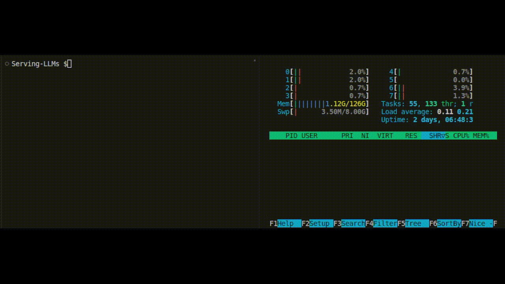

<h1 align="center">
  <!--  -->
  LLM Serving and Inference
</h1>

This repository showcases examples of utilizing libraries like llamafile for efficient deployment of large language models (LLMs) on consumer-grade CPU hardware, emphasizing high-throughput and memory-efficient inference.

 

<a href="#introduction">Introduction</a> &nbsp;&bull;&nbsp;
<a href="#demo-notebooks">Demo. Notebooks</a> &nbsp;&bull;&nbsp;
<a href="#references">References</a> &nbsp;&bull;&nbsp;
<a href="#issues">Issues</a> &nbsp;&bull;&nbsp;
<a href="#todos">TODOs</a>

  
  
  

# Introduction
Open source large language models (LLMs) are being democratized in a variety of applications, but most of these LLMs still face fundamental issues by demanding **large memory** and **computational power (e.g., GPUs)**. To address these fundamental challenges, an increase in libraries and frameworks for LLM inference and serving are being developed. 

This repository is focused on demonstrating some of these packages which provide the following **benefits of low-latency, high-throughput, and cost-effectiveness**. Several of the notebooks in this repo. will demonstrate how to:
- Execute LLMs on CPUs instead of GPU hardware.
- Execute quantized `Llama-2` models that are ~4GB in size.
- Obtain hidden dimension embeddings from GGUF models.

# Demo Notebooks
## llamafile
[llamafile](https://github.com/Mozilla-Ocho/llamafile/tree/0.2.1) lets you distribute LLMs with a single binary file. llamafile is the fastest executable file format ever and it lets you turn LLM weights into runnable llama.cpp binaries using cosmo libc. It executes on six different OSes and can run on CPU or GPUs. The following notebooks show examples of how to call and execute LLMs using the [llamafile](https://github.com/Mozilla-Ocho/llamafile/tree/0.2.1) library. The files in folder `llamafile-assets` were downloaded from [here](https://github.com/Mozilla-Ocho/llamafile/releases/tag/0.2.1).

 
    
     
    8-Core CPU Executing <a href="https://github.com/Mozilla-Ocho/llamafile/tree/0.2.1">llamafile Command-line Binary</a> with <a href="https://huggingface.co/jartine">Mistral-7B</a>

1.) [**llamafile command-line binary**](./notebooks/llamafile-cli-model.ipynb): this notebook demonstrates how to execute [jartine/mistral-7b.llamafile](https://huggingface.co/jartine) from the command line and then save the model's output to a text file.

2.) [**llamafile with external model weights**](./notebooks/llamafile-external-weights.ipynb): this notebook demonstrates how to execute a LLM downloaded in the **.GGUF** file format using `llamafile-main` and then save the model's output to a text file.

## LLaMa.cpp
LLaMa.cpp (or LLaMa C++) provides a lighter, more portable alternative to heavyweight frameworks. LLaMa.cpp was developed by Georgi Gerganov. It implements the Meta’s LLaMa architecture in efficient C/C++, and it is one of the most dynamic open-source communities around the LLM inference [[Source](https://www.datacamp.com/tutorial/llama-cpp-tutorial)].

1.) [**llama.cpp embeddings**](./notebooks/llamacpp-embeddings.ipynb): this notebook demonstrates how to get hidden dimension embeddings from a single pass through a GGUF model. Once the embeddings are available they can be used for several ML/AI techniques such as classification, text-similarity, clustering, etc.

# References
1) File Formats: 
    - [GGML Georgi Gerganov's Machine Learning](https://medium.com/@phillipgimmi/what-is-gguf-and-ggml-e364834d241c)
    - [GGUF (GPT-Generated Unified Format)](https://medium.com/@phillipgimmi/what-is-gguf-and-ggml-e364834d241c)
        - [How do I create a GGUF model file?](https://www.secondstate.io/articles/convert-pytorch-to-gguf/)
        - Download GGUF files from [Hugging Face - The Bloke](https://huggingface.co/TheBloke); also see [TheBloke (Tom Jobbins)](https://github.com/TheBloke).
3) Libraries and Frameworks:
    - [DeepSpeed MII](https://github.com/microsoft/DeepSpeed-MII)
    - [llamafile](https://github.com/Mozilla-Ocho/llamafile/tree/0.2.1)
    - [vLLM](https://github.com/vllm-project/vllm)
    - [LLaMA.cpp](https://github.com/ggerganov/llama.cpp)
4) Articles and Blogs:
    - [A Comprehensive Guide to LLMs’ Inference and Serving](https://www.e2enetworks.com/blog/a-comprehensive-guide-to-llms-inference-and-serving-2)
    - [7 Frameworks for Serving LLMs](https://betterprogramming.pub/frameworks-for-serving-llms-60b7f7b23407)

# Issues
This repository is will do its best to be maintained. If you face any issue or want to make improvements please <a href="https://github.com/mddunlap924/Serving-LLMs/issues">raise an issue</a> or submit a Pull Request. :smiley:

# TODOs
- [ ] Feel free to raise an Issue for a feature you would like to see added.

#### Liked the work? Please give a star!